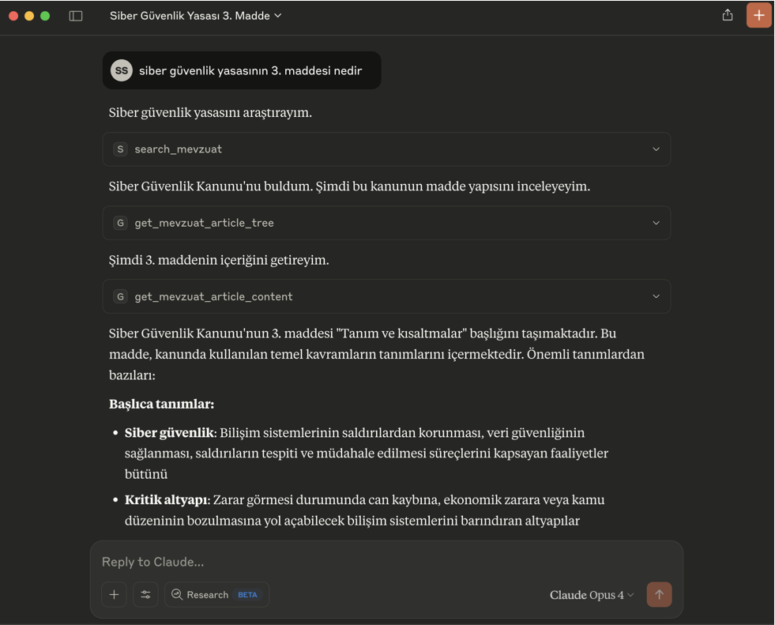
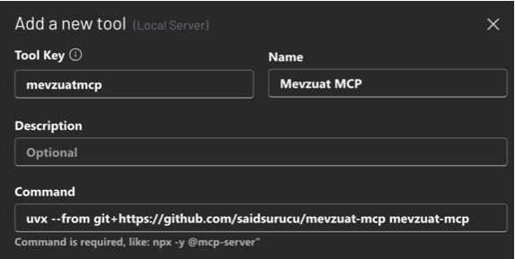

# Mevzuat MCP: Adalet Bakanlığı Mevzuat Bilgi Sistemi için MCP Sunucusu

Bu proje, Adalet Bakanlığı'na ait Mevzuat Bilgi Sistemi'ne (`mevzuat.gov.tr`) erişimi kolaylaştıran bir [FastMCP](https://gofastmcp.com/) sunucusu oluşturur. Bu sayede, Mevzuat Bilgi Sistemi'nden mevzuat arama ve tüm mevzuat içeriklerini Markdown formatında alma işlemleri, Model Context Protocol (MCP) destekleyen LLM (Büyük Dil Modeli) uygulamaları (örneğin Claude Desktop veya [5ire](https://5ire.app)) ve diğer istemciler tarafından araç (tool) olarak kullanılabilir hale gelir.



🎯 **Temel Özellikler**

* Adalet Bakanlığı Mevzuat Bilgi Sistemi'ne programatik erişim için standart bir MCP arayüzü.
* 21 farklı tool ile kapsamlı mevzuat erişimi:
    * **Kanun (Laws)** - Türkiye Cumhuriyeti kanunları
    * **KHK (Decree Laws)** - Kanun Hükmünde Kararnameler
    * **Tüzük (Statutes)** - Tüzükler
    * **Kurum Yönetmeliği (Institutional Regulations)** - Kurum ve kuruluş yönetmelikleri
    * **Cumhurbaşkanlığı Kararnamesi (Presidential Decrees)** - Cumhurbaşkanlığı kararnameleri
    * **Cumhurbaşkanı Kararı (Presidential Decisions)** - Cumhurbaşkanı kararları
    * **CB Yönetmeliği (Presidential Regulations)** - Cumhurbaşkanlığı ve Bakanlar Kurulu yönetmelikleri
    * **CB Genelgesi (Presidential Circulars)** - Cumhurbaşkanlığı genelgeleri
    * **Tebliğ (Communiqués)** - Tebliğler
* Her mevzuat türü için çift tool yapısı:
    * **Arama tool'u**: Başlık ve içerikte arama, Boolean operatörler (AND, OR, NOT), tarih filtreleme
    * **İçinde arama tool'u**: Madde bazında arama (keyword + semantik), alakalılık skoru ile sıralama
* **Semantik Arama (Yeni!)**: Tüm 9 `search_within_*` aracında `semantic=True` parametresi ile doğal dilde anlam tabanlı arama. OpenRouter API üzerinden embedding modelleri kullanır.
* Gelişmiş özellikler:
    * PDF'leri Mistral OCR ile metin çıkarma (CB Kararı ve CB Genelgesi için)
    * HTML'den Markdown'a otomatik dönüştürme
    * In-memory caching (1 saat TTL) ile hızlı erişim
    * Boolean arama operatörleri (AND, OR, NOT)
    * Tam cümle araması (exact phrase)
    * Tarih aralığı filtreleme
* Claude Desktop ve 5ire gibi MCP istemcileri ile kolay entegrasyon

---
🌐 **En Kolay Yol: Ücretsiz Remote MCP (Claude Desktop için)**

Hiçbir kurulum gerektirmeyen, doğrudan kullanıma hazır MCP sunucusu:

1. Claude Desktop'ı açın
2. **Settings > Connectors > Add custom connector**
3. Açılan pencerede:
   * **Name:** `Mevzuat MCP`
   * **URL:** `https://mevzuat.surucu.dev/mcp`
4. **Save** butonuna basın

Hepsi bu kadar! Artık Mevzuat MCP ile konuşabilirsiniz.

> **Not:** Bu ücretsiz sunucu topluluk için sağlanmaktadır. Yoğun kullanım için kendi sunucunuzu kurmanız önerilir.

---
🚀 **Claude Haricindeki Modellerle Kullanmak İçin Çok Kolay Kurulum (Örnek: 5ire için)**

Bu bölüm, Mevzuat MCP aracını 5ire gibi Claude Desktop dışındaki MCP istemcileriyle kullanmak isteyenler içindir.

* **Python Kurulumu:** Sisteminizde Python 3.11 veya üzeri kurulu olmalıdır. Kurulum sırasında "**Add Python to PATH**" (Python'ı PATH'e ekle) seçeneğini işaretlemeyi unutmayın. [Buradan](https://www.python.org/downloads/) indirebilirsiniz.
* **Git Kurulumu (Windows):** Bilgisayarınıza [git](https://git-scm.com/downloads/win) yazılımını indirip kurun. "Git for Windows/x64 Setup" seçeneğini indirmelisiniz.
* **`uv` Kurulumu:**
    * **Windows Kullanıcıları (PowerShell):** Bir CMD ekranı açın ve bu kodu çalıştırın: `powershell -ExecutionPolicy ByPass -c "irm https://astral.sh/uv/install.ps1 | iex"`
    * **Mac/Linux Kullanıcıları (Terminal):** Bir Terminal ekranı açın ve bu kodu çalıştırın: `curl -LsSf https://astral.sh/uv/install.sh | sh`
* **Microsoft Visual C++ Redistributable (Windows):** Bazı Python paketlerinin doğru çalışması için gereklidir. [Buradan](https://learn.microsoft.com/en-us/cpp/windows/latest-supported-vc-redist?view=msvc-170) indirip kurun.
* İşletim sisteminize uygun [5ire](https://5ire.app) MCP istemcisini indirip kurun.
* 5ire'ı açın. **Workspace -> Providers** menüsünden kullanmak istediğiniz LLM servisinin API anahtarını girin.
* **Tools** menüsüne girin. **+Local** veya **New** yazan butona basın.
    * **Tool Key:** `mevzuatmcp`
    * **Name:** `Mevzuat MCP`
    * **Command:**
        ```
        uvx --from git+https://github.com/saidsurucu/mevzuat-mcp mevzuat-mcp
        ```
    * **Save** butonuna basarak kaydedin.

* Şimdi **Tools** altında **Mevzuat MCP**'yi görüyor olmalısınız. Üstüne geldiğinizde sağda çıkan butona tıklayıp etkinleştirin (yeşil ışık yanmalı).
* Artık Mevzuat MCP ile konuşabilirsiniz.

---
⚙️ **Claude Desktop Manuel Kurulumu**


1.  **Ön Gereksinimler:** Python, `uv`, (Windows için) Microsoft Visual C++ Redistributable'ın sisteminizde kurulu olduğundan emin olun. Detaylı bilgi için yukarıdaki "5ire için Kurulum" bölümündeki ilgili adımlara bakabilirsiniz.
2.  Claude Desktop **Settings -> Developer -> Edit Config**.
3.  Açılan `claude_desktop_config.json` dosyasına `mcpServers` altına ekleyin:

    ```json
    {
      "mcpServers": {
        // ... (varsa diğer sunucularınız) ...
        "Mevzuat MCP": {
          "command": "uvx",
          "args": [
            "--from",
            "git+https://github.com/saidsurucu/mevzuat-mcp",
            "mevzuat-mcp"
          ]
        }
      }
    }
    ```
4.  Claude Desktop'ı kapatıp yeniden başlatın.

---
🔑 **API Anahtarları (Opsiyonel)**

### Semantik Arama - OpenRouter API

Tüm `search_within_*` araçlarında `semantic=True` ile doğal dilde arama yapabilmek için:

1. [OpenRouter](https://openrouter.ai/) üzerinden API anahtarı alın
2. Environment variable olarak ayarlayın:
   ```bash
   OPENROUTER_API_KEY=your_api_key_here
   ```
3. Varsayılan model: `google/gemini-embedding-001` (3072 boyut). Alternatif olarak:
   ```bash
   EMBEDDING_MODEL=intfloat/multilingual-e5-large  # 1024 boyut
   ```
4. API anahtarı olmadan da tüm araçlar çalışır, sadece `semantic=True` kullanılamaz

### Mistral OCR

CB Kararı ve CB Genelgesi gibi PDF tabanlı mevzuatlar için Mistral OCR kullanılır:

1. [Mistral AI Console](https://console.mistral.ai/) üzerinden API anahtarı alın
2. Environment variable olarak ayarlayın:
   ```bash
   MISTRAL_API_KEY=your_api_key_here
   ```
3. API anahtarı olmadan da sistem çalışır, ancak PDF'ler markitdown ile işlenir (daha düşük kalite)

---
🛠️ **Kullanılabilir Araçlar (MCP Tools)**

Bu FastMCP sunucusu LLM modelleri için **21 araç** sunar.

### Kanun (Laws)
* **`search_kanun`**: Kanun başlık ve içeriklerinde arama yapar
* **`search_within_kanun`**: Kanun maddelerinde anahtar kelime veya semantik arama yapar

### KHK (Decree Laws)
* **`search_khk`**: KHK başlık ve içeriklerinde arama yapar
* **`search_within_khk`**: KHK maddelerinde anahtar kelime veya semantik arama yapar

### Tüzük (Statutes)
* **`search_tuzuk`**: Tüzük başlık ve içeriklerinde arama yapar
* **`search_within_tuzuk`**: Tüzük maddelerinde anahtar kelime veya semantik arama yapar

### Kurum Yönetmeliği (Institutional Regulations)
* **`search_kurum_yonetmelik`**: Kurum yönetmeliği başlık ve içeriklerinde arama yapar
* **`search_within_kurum_yonetmelik`**: Kurum yönetmeliği maddelerinde anahtar kelime veya semantik arama yapar

### Cumhurbaşkanlığı Kararnamesi (Presidential Decrees)
* **`search_cbk`**: CB Kararnamesi başlık ve içeriklerinde arama yapar
* **`search_within_cbk`**: CB Kararnamesi maddelerinde anahtar kelime veya semantik arama yapar

### Cumhurbaşkanı Kararı (Presidential Decisions)
* **`search_cbbaskankarar`**: CB Kararı başlık ve içeriklerinde arama yapar
* **`get_cbbaskankarar_content`**: CB Kararı tam içeriğini getirir (PDF - OCR destekli)
* **`search_within_cbbaskankarar`**: CB Kararı içeriğinde anahtar kelime veya semantik arama yapar

### CB Yönetmeliği (Presidential Regulations)
* **`search_cbyonetmelik`**: CB Yönetmeliği başlık ve içeriklerinde arama yapar
* **`search_within_cbyonetmelik`**: CB Yönetmeliği maddelerinde anahtar kelime veya semantik arama yapar

### CB Genelgesi (Presidential Circulars)
* **`search_cbgenelge`**: CB Genelgesi başlıklarında arama yapar
* **`get_cbgenelge_content`**: CB Genelgesi tam içeriğini getirir (PDF - OCR destekli)
* **`search_within_cbgenelge`**: CB Genelgesi içeriğinde anahtar kelime veya semantik arama yapar

### Tebliğ (Communiqués)
* **`search_teblig`**: Tebliğ başlık ve içeriklerinde arama yapar
* **`get_teblig_content`**: Tebliğ tam içeriğini getirir
* **`search_within_teblig`**: Tebliğ maddelerinde anahtar kelime veya semantik arama yapar

### Ortak Parametreler

**Arama Tool'ları için:**
* `aranacak_ifade`: Aranacak kelime veya kelime grupları (AND, OR, NOT operatörleri desteklenir)
* `tam_cumle`: Tam cümle eşleşmesi (exact phrase)
* `baslangic_tarihi` / `bitis_tarihi`: Tarih aralığı filtreleme
* `page_number`, `page_size`: Sayfalama

**İçinde Arama Tool'ları için:**
* `mevzuat_no`: Mevzuat numarası (arama sonucundan alınır)
* `keyword`: Aranacak anahtar kelime veya doğal dilde sorgu
* `semantic`: `True` ise semantik arama, `False` ise anahtar kelime araması (varsayılan: `False`)
* `case_sensitive`: Büyük/küçük harf duyarlılığı (sadece keyword modunda)
* `max_results`: Maksimum sonuç sayısı

### Arama Modları

**Keyword Modu** (`semantic=False`, varsayılan):
```
keyword: "yatırımcı AND tazmin"
```
Boolean operatörler (AND, OR, NOT) ile kesin kelime eşleşmesi. Operatörler BÜYÜK HARF olmalıdır.

**Semantik Mod** (`semantic=True`):
```
keyword: "yatırımcının zararının tazmini"
```
Doğal dilde anlam tabanlı arama. Kelime eşleşmesi aramaz, kavramsal benzerlik ile sonuç döner. `OPENROUTER_API_KEY` gerektirir.

---
📜 **Lisans**

Bu proje MIT Lisansı altında lisanslanmıştır. Detaylar için `LICENSE` dosyasına bakınız.
